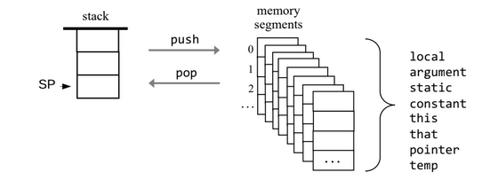
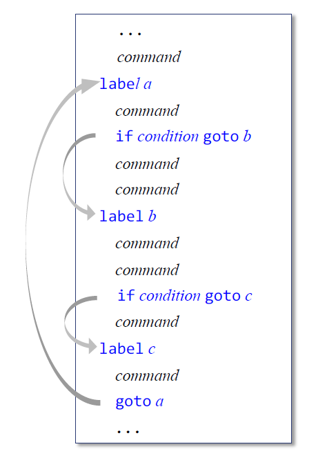
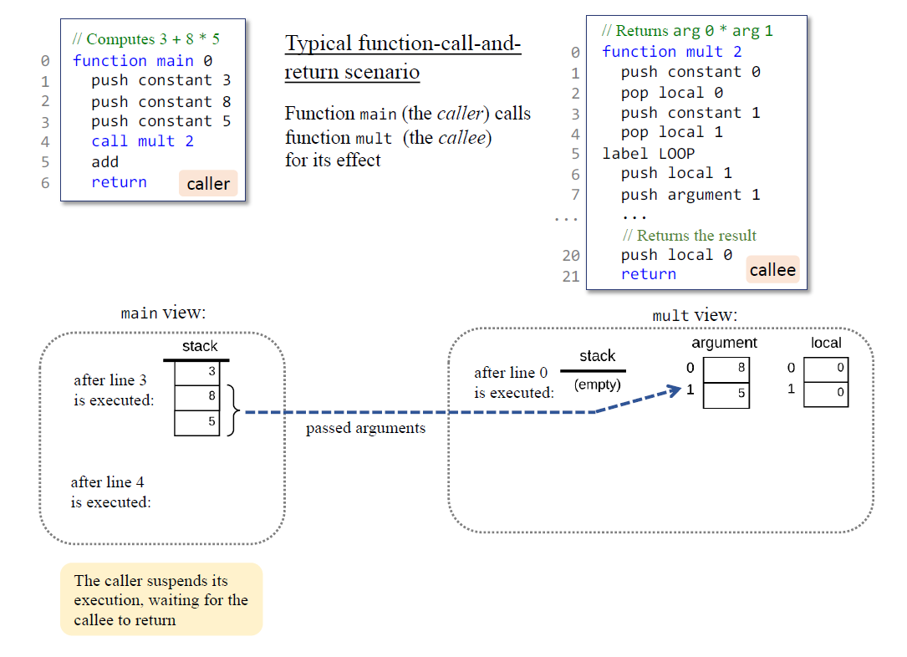
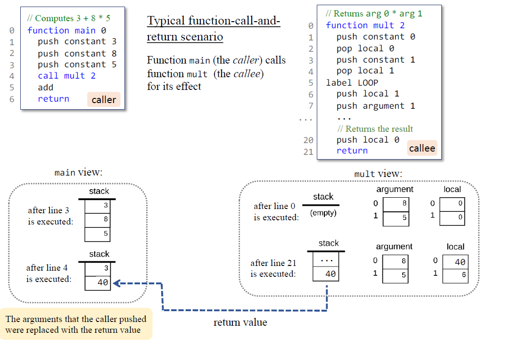
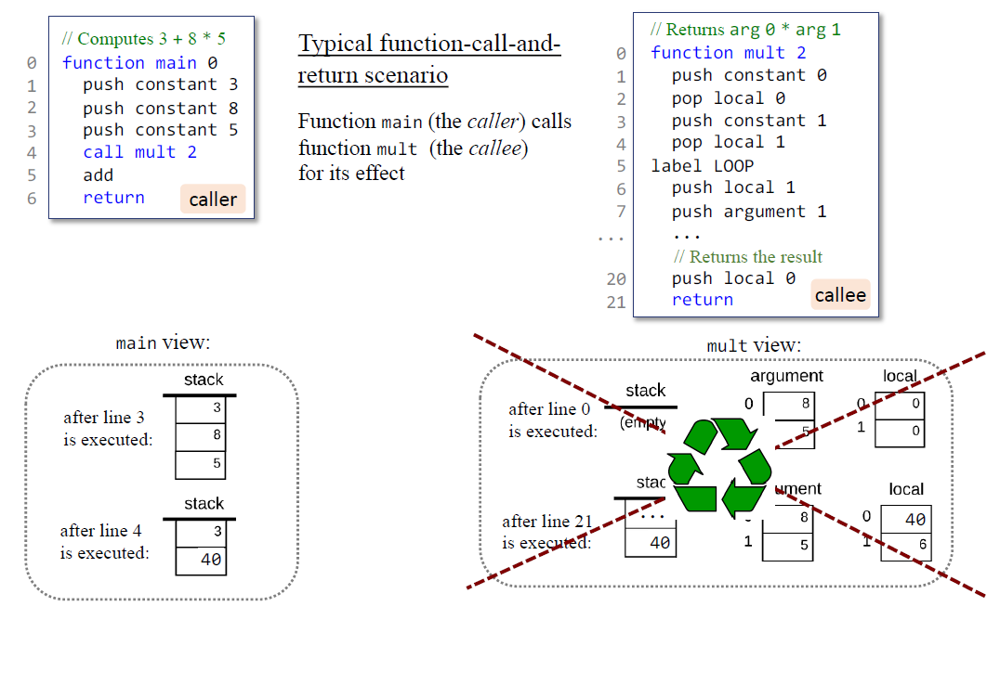
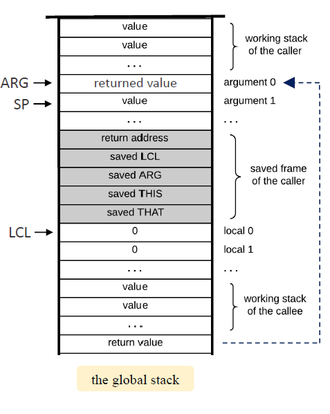

# Virtual Machine Translator

## Background

Java (or C#) compilers generate code written in an intermediate language called bytecode (or IL). This code is designed to run on a virtual machine architecture like the JVM (or CLR). One way to implement such VM programs is to translate them further into lower-level programs written in the machine language of some concrete (rather than virtual) host computer. I have built such a VM translator, designed to translate programs written in the VM language into programs written in the Hack assembly language.


## Implementation

We propose implementing in two stages. This will allow us to unit-test our implementation incrementally, using test programs . In what follows, when we say "the VM translator should implement some VM command" we mean "the VM translator should translate the given VM command into a sequence of Hack assembly commands that accomplish the same task".
 


Stage I: Handling stack arithmetic commands: The first version of the basic VM translator should implement the nine arithmetic / logical commands **(add, sub , neg ,eq , gt , lt, and , or , not)** of the VM language as well as the VM command push constant x.


 
The latter command is the generic push command for which the first argument is constant and the second argument is some non-negative integer x. This command comes handy at this early stage, since it helps provide values for testing the implementation of the arithmetic / logical VM commands. For example, in order to test how the VM translator handles the VM add command, we can test how it handles the VM code push constant 3, push constant 5, add. The other arithmetic and logical commands are tested similarly.

 

Stage II: Handling memory access commands: The next version of the basic VM translator should include a full implementation of the VM language's push and pop commands, handling the eight memory segments described as follows **constant ,local, argument, this, that, pointer, temp, static segments** . 
and also includes the Branching commands (label ,if-goto , goto)
and Function commands (**function** which declares a function , **call** which used to call a function ,**return** which used to return from a function ) 

### Push and Pop commands

</br>

### Branching commands

</br>

### Function commands

#### Call command
</br>

#### Function excution & Return commands

</br>

#### Memory recycle after return command

</br>

### Working Stack during excution
</br>

## Preparing the code to work
### After we Translate the code we need add Bootstrap code to initailize the Virtual machine memory before starting the code 

</br>

## The big picture
### At the end the overall Translator work is to produce code that work efficiently and smoothly on the paltform the will excute the code by handling complex not only naive oprations such as 
* ### defining and creating variables .
* ### Loops , conditional and unconditional branches.
* ### Classes , Objects , Member variables and Methods .
* ### Functions creation , calls and returns .
* ### Recursion issues .
* ### Static and Global variables .
* ### Including different Classes(Liberaries) .
* ### ... etc.
</br>

## Usage

```bash
  VMTranslator.exe [Filename(s)/path or directory name/path]
```

## Notes

### These are some sympols and rules that the translator uses/follows to perform it's job .
</br>
 
### At [docs/Examples](./docs/Examples) folder some examples for VM files translated to asm .

## Badges


[](https://choosealicense.com/licenses/mit/)


